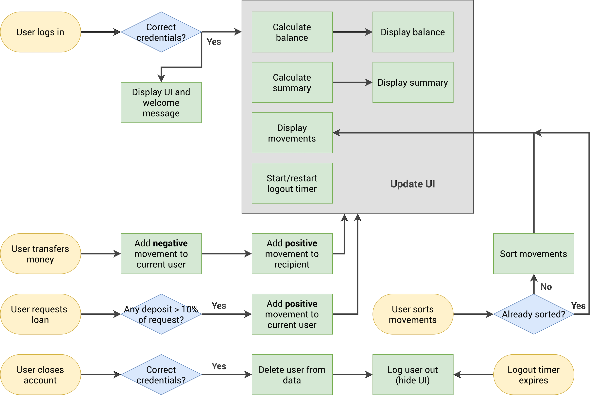

# bankist app
*dummy project from https://github.com/jonasschmedtmann/complete-javascript-course*

## About the Project
An iteractive bank app that provides:
- transfer between users
- request loan

## Flowchart


## How to Use
- Open the app [here](https://ihsanramdhani.github.io/bankist/)
- Login user 1:
```
js
```
```
1111
```
- Login user 2:
```
jd
```
```
2222
```